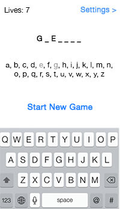
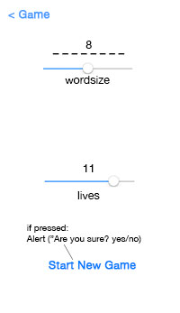

#Evil Hangman: design document#

##### Emiel Hoogeboom #####
##### Hangman #####
##### Date: 14 - 11 - 2013 #####

The following document provides an insight into the user interface of the app, as well as the underlying structure. The contents of this document are as follows: First the document will discuss the user interface, then the classes and finally the libraries the program will use.

###User Interface and Human Interaction###

 
  
The first screen is the main ViewController of the application. This screen will continue an existing game or start a new one. The game input is a letter, when a letter is entered, it is greyed out on the guessedLabel. The user is shown whether the letter is present in the word and where it is located. The settings button takes the user to the picture on the right: the SettingsViewController. Here the wordsize an the amount of guesses(lives) can be specified. If the new game button is clicked, a new game with the new settings can be started. If you however go back without pressing the button, the current game can still be played. On the MainViewController the new game button is also present.  
NSUserDefaults is used to read the values for the keys "wordsize" and "lives". If they do not exist, they are recreated with default values for wordsize and lives. They are then saved. When settings are changed, they are also saved.

###List of classes and public methods:###
HangmanBrain, handles the main game mechanics for when a word is being guessed.
- (BOOL)checkIfWon;
- (void)guessLetter:(char)guess;

State, saves the current state of program to disk.
- (NSString *)getGuesses;
- (void)saveGuesses(NSString *);

MainViewController, controls the main view of the application
- @property (weak, nonatomic) IBOutlet UILabel *guessedLabel;
- @property (weak, nonatomic) IBOutlet UILabel *wordLabel;
- @property (weak, nonatomic) IBOutlet UITextField *guessField;

- (IBAction)checkUserInput:(UIButton *)sender;
- (IBAction)settingsButton:(UIButton *)sender;

SettingsViewController, controls the settings view of the application.
- @property (weak, nonatomic) IBOutlet UILabel *wordsizeLabel;
- @property (weak, nonatomic) IBOutlet UISlider *wordsize;
- @property (weak, nonatomic) IBOutlet UILabel *livesLabel;
- @property (weak, nonatomic) IBOutlet UISlider *lives;
- (IBAction)backButton:(UIButton *)sender;

###Libraries used by the program###
- UIKit: For user interface elements
- Foundation: To use Objective-C elements like NSObject
